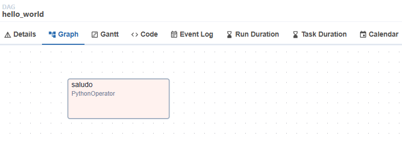
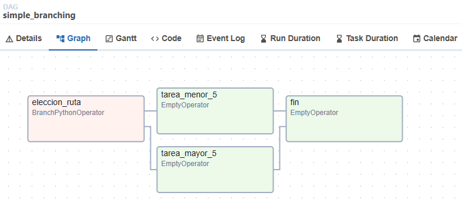
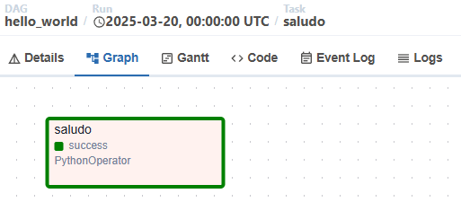
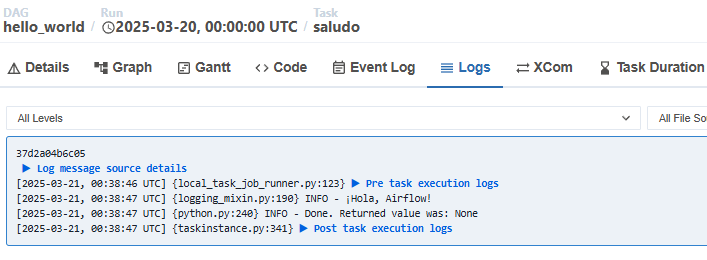

# 📊 DAGs Básicos en Apache Airflow

## 📝 Descripción

Esta carpeta contiene ejemplos simples de **DAGs** (Directed Acyclic Graphs) para comenzar a familiarizarte con el uso de Airflow y las bases del funcionamiento de un DAG. Estos DAGs son básicos y estan diseñados para que funcionen con el entorno por defecto proporcionado en el **Quickstart**. Por lo que no es necesario instalar dependencias adicionales.


## 📑 Tabla de Contenidos

- [📝 Descripción](#-descripción)
- [🧠 ¿Qué es un DAG en Airflow?](#-qué-es-un-dag-en-airflow?)
- [⚙️ Estructura de un DAG](#%EF%B8%8F-estructura-de-un-dag)
- [🛠️ DAGs Incluidos](#%EF%B8%8F-dags-incluidos)
    - [1. DAG Hello World](#1-dag-hello-world)
    - [2. DAG con BashOperator](#2-dag-con-bashoperator)
    - [3. DAG con dependencias entre tareas](#3-dag-con-dependencias-entre-tareas)
    - [4. DAG con Branching (ramificación condicional)](#4-dag-con-branching-ramificación-condicional)
- [🚀 Cómo Usar los DAGs](#-cómo-usar-los-dags)
- [🔗 Referencias](#-referencias)


## 🧠 ¿Qué es un DAG en Airflow?

Un **DAG (Directed Acyclic Graph)** en Apache Airflow es una colección de tareas organizadas de forma que se ejecuten en un orden específico y sin ciclos. Los DAGs permiten automatizar procesos complejos dividiéndolos en tareas individuales conectadas entre sí.

### Componentes Principales de un DAG

- **Tareas (Tasks):** Unidades individuales de trabajo (e.g., ejecutar un script, mover datos, realizar cálculos).
- **Operadores (Operators):** Definen la acción de cada tarea (e.g., `PythonOperator`, `BashOperator`).
- **Dependencias:** Relaciones que dictan el orden de ejecución de las tareas.
- **Programación (Scheduling):** Define cuándo y con qué frecuencia se ejecutará el DAG.


## ⚙️ Estructura de un DAG

```python
# Librerias necesarias
from airflow import DAG     # Para instanciar un DAG
from airflow.operators...   # Para importar tipos de operadores

def tarea_fun():
    # Funcion con la tarea
    # TODO: La tarea aqui

with DAG('nombre_del_dag',                  # Nombre del DAG
         start_date=datetime(2025, 1, 1),   # Fecha de inicio
         schedule_interval='@daily',        # Frecuencia de ejecución
         catchup=False
        ) as dag:
    # Definir el operador con la tarea a ejecutar
    tarea = PythonOperator(
        task_id='saludo',            # Nombre de la tarea
        python_callable=tarea_fun    # Funcion a ejecutar
    )
```

## 🛠️ DAGs Incluidos

### 1. DAG Hello World

**Archivo:** `dag_hello_world.py`

Este es el ejemplo más básico: un DAG con una sola tarea que imprime un mensaje en los logs usando `PythonOperator`.

#### Tarea
- Imprime: `¡Hola, Airflow!`

#### Operadores usados
- `PythonOperator`

#### Vista esperada



### 2. DAG con BashOperator

**Archivo:** `dag_bash_operator.py`

Este DAG ejecuta un comando Bash simple que imprime un mensaje.

#### Tarea
- Ejecuta: `echo 'Este es un comando Bash ejecutado desde Airflow'`

#### Operadores usados
- `BashOperator`

#### Vista esperada


### 3. DAG con dependencias entre tareas

**Archivo:** `dag_dependencies.py`

Este DAG contiene tres tareas conectadas en secuencia (`inicio >> proceso >> fin`). Cada una imprime un mensaje diferente.

#### Flujo de ejecución
1. `inicio`: imprime "Inicio del proceso"
2. `proceso`: imprime "Procesando datos..."
3. `fin`: imprime "Proceso finalizado"

#### Operadores usados
- `PythonOperator`

#### Vista esperada


### 4. DAG con Branching (ramificación condicional)

**Archivo:** `dag_branching.py`

Este DAG demuestra cómo usar `BranchPythonOperator` para ejecutar una u otra tarea según una condición (en este caso, un número aleatorio entre 1 y 10).

#### Lógica del DAG
- Se genera un número aleatorio.
- Si es mayor a 5, se ejecuta `tarea_mayor_5`.
- Si es menor o igual, se ejecuta `tarea_menor_5`.
- Ambas tareas convergen en `fin`.

#### Operadores usados
- `BranchPythonOperator`
- `EmptyOperator` (sustituto moderno de `DummyOperator`)

#### Vista esperada



## 🚀 Cómo Usar los DAGs


1. Reinicia el servidor de Airflow para cargar los nuevos DAGs.

```bash
docker compose restart airflow-webserver
```


2. Accede a la interfaz web de Airflow en [http://localhost:8080](http://localhost:8080) y verifica que los DAGs de la siguiente forma:
    


3. Prueba ejecutar un DAG por medio de la interfaz y comprueba su funcionamiento, para lograrlo navega a cualquiera de los DAGs y presiona el botón de `trigger dag`:
    
    


    Luego ve a la ventana de graph, selecciona la tarea que deseas verificar y visita logs, 
    
    

    En el log deberias de ver la ejecución del DAG, para el ejemplo de `Hello World` el log se ve así:
    
    
    


## 🔗 Referencias
Para mas información puedes visitar la siguiente documentación:

- [Documentación Oficial de Apache Airflow](https://airflow.apache.org/)
- [Guía de Operadores en Airflow](https://airflow.apache.org/docs/apache-airflow/stable/howto/operator/index.html)

